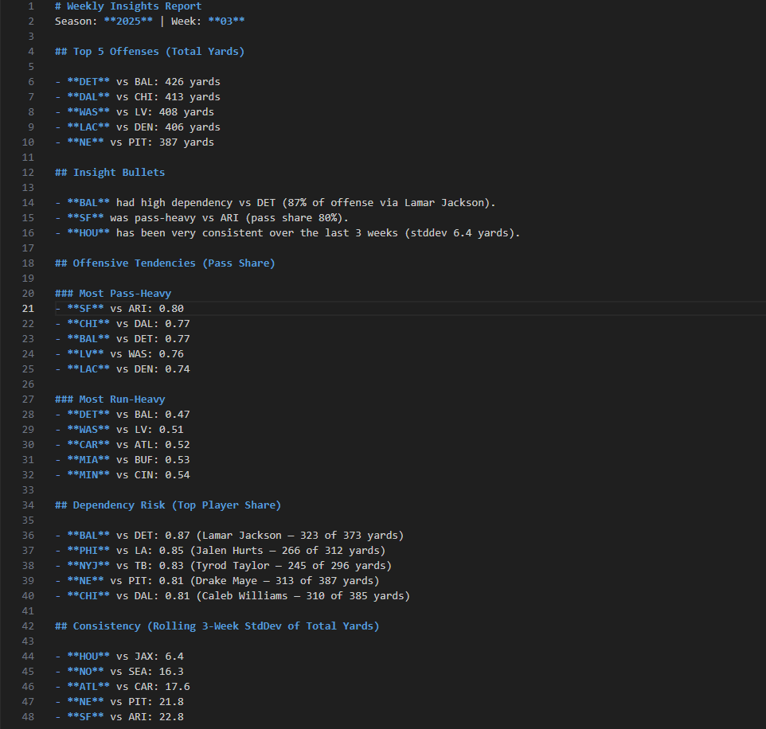

# Event-to-Insight Analytics Pipeline (NFL Dataset)

A production-style analytics pipeline that ingests real-world NFL event data, models it into analytics-ready tables using DuckDB, and generates decision-oriented weekly insight reports along with a reusable SQL analysis pack.

NFL is just the dataset — the architecture mirrors how you would build an analytics pipeline for any event-driven domain (application logs, transactions, telemetry, etc.).

---

## Setup

### Create and Activate a Virtual Environment (Recommended)

```bash
python -m venv .venv
```

```bash
# macOS / Linux
source .venv/bin/activate

# Windows
.venv\Scripts\activate
```

### Install Dependencies

```bash
pip install -r requirements.txt
```

---

## Running the Pipeline

### Run a Single Week

```bash
python run_pipeline.py --season 2025 --week 3
```

### Run a Range of Weeks

```bash
python run_pipeline.py --season 2025 --weeks 1-6
```

---

## Output Locations

### DuckDB Database
```
data/analytics.duckdb
```

### Weekly Reports
```
reports/season_<YEAR>/week_<WW>.md
```

---

## Data Model Overview

### Core Tables

#### core_games
- One row per game  
- Keys: (season, week, game_id)  
- Includes: home/away teams, scores, date  

#### core_player_game_stats
- One row per player per game  
- Includes:
  - Passing yards
  - Rushing yards
  - Receiving yards

Official total yards:
```
player_total_yards_official = passing_yards + rushing_yards
```

#### core_team_week_metrics
- One row per team per week  
- Includes:
```
team_total_yards = team_pass_yards + team_rush_yards
```

---

## Mart Tables

### mart_team_week_insights
Derived, decision-oriented metrics:
- pass_share
- top_player_share
- top_player_name
- top_player_yards
- high_dependency_flag

### mart_team_week_volatility
Rolling 3-week metrics:
- rolling_std_total_yards

---

## Unified Analysis View

### mart_team_week (VIEW)

Joins:
- core_team_week_metrics
- mart_team_week_insights
- mart_team_week_volatility

All SQL analysis queries operate on this view.

---

## Example Weekly Report Output



### Insight Bullets
- **BAL** had high dependency vs DET (87% of offense via Lamar Jackson).
- **SF** was pass-heavy vs ARI (pass share 80%).
- **HOU** has been very consistent over the last 3 weeks (stddev 6.4 yards).

---

## SQL Analysis Pack

The /sql directory contains reusable, tested analytics queries.

### Create / Refresh the Mart View

```bash
python -c "import duckdb; con=duckdb.connect('data/analytics.duckdb'); con.execute(open('sql/00_create_mart_view.sql','r',encoding='utf-8').read()); con.close()"
```

### Run a Single SQL File

```bash
python -c "import duckdb; con=duckdb.connect('data/analytics.duckdb'); print(con.execute(open('sql/01_top_offenses_week.sql','r',encoding='utf-8').read()).df()); con.close()"
```

### Run the Full SQL Test Pack

```bash
python tests/run_sql_pack.py
```

Expected output:
```
Ran 10 SQL files.
SQL pack passed (all queries executed).
```

---

## Design Notes
- Metrics favor correctness and interpretability over complexity
- Dependency risk is expected to highlight QBs in most cases
- Rolling metrics activate starting Week 3
- Designed to be extensible to other datasets and domains

---

## Future Improvements
- Parameterized SQL pack (season/week inputs)
- HTML or dashboard-based reports
- Efficiency metrics (EPA/play, success rate)
- Optional cloud warehouse targets (Snowflake / BigQuery)
